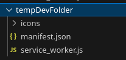
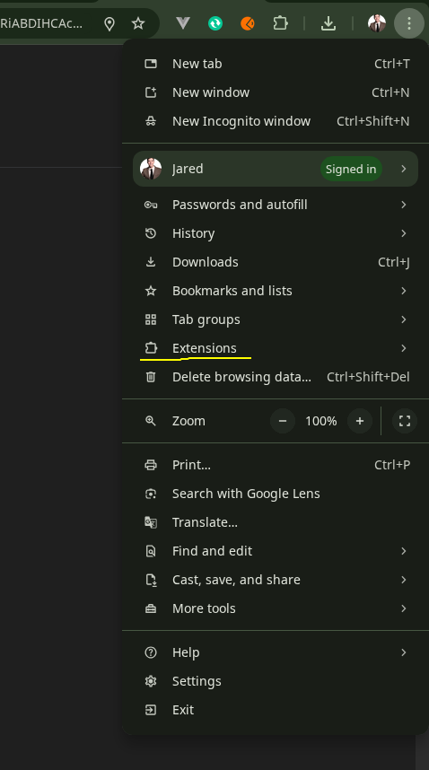
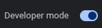
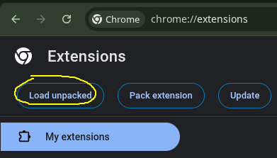
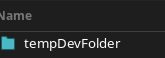
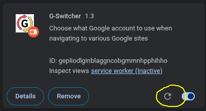
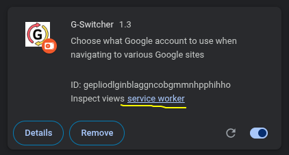

## 📂 G-Switcher

This Chrome extension solves the common problem of **Google apps automatically routing logged-in users to their primary account** (`/u/0/`) instead of presenting the account selection screen.

By installing this extension, navigating to any supported Google domain (like `mail.google.com` or `drive.google.com`) will reliably **force the Google Account Chooser**, allowing you to select which profile you want to access every time.

---

### 🚀 Features

- **Forces Account Selection:** Interrupts the default Google app redirection across multiple services, ensuring the multi-account selector page is always displayed.
- **Broad Compatibility:** Supports the following popular Google applications:
  - **Drive** (`drive.google.com`)
  - **Gmail / Mail** (`mail.google.com` / `gmail.com`)
  - **Sheets** (`sheets.google.com`)
  - **Docs** (`docs.google.com`)
  - **Photos** (`photos.google.com`)
  - **Chat** (`chat.google.com`)
  - **Meet** (`meet.google.com`)
- **Simple & Lightweight:** Runs entirely in the background using a **Service Worker** and has no visual interface (no popup or toolbar icon needed).
- **Minimal Permissions:** Only requires the `webNavigation` permission to monitor when you visit the supported domains.

---

### ⚙️ How It Works

The extension uses the `webNavigation` API to listen for any attempt to navigate to a supported Google homepage.

When a match is detected on any of the supported domains, the extension redirects the browser to the specific Google URL designed to show the **Account Chooser**, using the originally requested URL as the `continue` parameter.

> **Example:** Navigating to `https://drive.google.com/` is redirected to:
> `https://accounts.google.com/AccountChooser?continue=https://drive.google.com/`
> This ensures the user is prompted to select their profile before proceeding to the service.

---

### 💾 Installing in your Chrome browser

The extension is live on the Chrome Web Store: **[here is the link](https://chromewebstore.google.com/detail/g-switcher/ddbagfifdmgfeddnhimdloclojjgfpbb?authuser=0&hl=en)**. All you have to do is click the link and hit "**Add to Chrome**".

---

### 🛠️ Want to play with it locally?

If you want to install it manually for development or testing, follow these steps:

1.  **Download Files:** Ensure you have the required files (`manifest.json`, `service_worker.js`, and the `icons/` folder) in one root directory

    

2.  **Open Extensions:** Navigate to `chrome://extensions/` in your Chrome browser, or open the three-dot menu and go to **Extensions**

    

3.  **Enable Developer Mode:** Toggle the "**Developer mode**" switch on (usually in the upper right corner)

    

4.  **Load Unpacked:** Click the "**Load unpacked**" button.

    

5.  **Select Folder:** Choose the root folder containing your extension files.

    

6.  **Develop and reload:** The extension will now be installed and running in your browser. You can make changes and click the refresh icon to test.

    

7.  **Logs** View console logs by clicking _service worker_ button

    

---

### 📦 Packaging and Publishing

(This section is really a note-to-self for when I write updates).

#### 1. Packaging the Extension (Manual Distribution)

This creates a single `.crx` file for easy installation by others without needing "Load unpacked."

- **Open Extensions:** Navigate to `chrome://extensions/`.
- **Enable Developer Mode:** Ensure the "Developer mode" toggle is **ON**.
- **Pack Extension:** Click the "**Pack extension...**" button.
- **Select Root Directory:** Use the browser to select the root folder containing your `manifest.json` file.
- **Confirm:** Leave the private key file field blank (unless repacking an existing version) and click "**Pack extension**."

> **Note:** This generates a `.crx` file (the installable package) and a **`.pem` file** (your private key). **Keep the `.pem` file safe** as you will need it to update your extension later.

#### 2. Publishing to the Chrome Web Store (Public Distribution)

To list the extension publicly:

1.  **Set Up Developer Account:** Sign in to the [Chrome Web Store Developer Dashboard](https://chrome.google.com/webstore/developer/dashboard) and complete the one-time registration.
2.  **Prepare Assets:** Create the required promotional images (e.g., a Store Image with dimensions **1280x800**).
3.  **Create ZIP File:** Select all files in your root extension folder and compress them into a single `.zip` archive.
4.  **Upload:** In the Developer Dashboard, click "**Add new item**" and upload the `.zip` file.
5.  **Complete Listing:** Fill out the mandatory store information (detailed description, category, language, and public contact email).
6.  **Submit:** Click "**Submit for review**."

---

### 🚀 Releasing updates

(This also a note-to-self section).

1. Update `manifest.json` (update the version to a higher number).

2. Package the new version by createing a ZIP file of the entire extension directory. Ensure the manifest.json file is at the root of the ZIP file. You don't need to include `readme_assets`

3. Log into the Chrome Web Store Developer Dashboard, select the extension, and go to the Package Tab. This is where you upload the new extension files.

4. Upload the New Package: Click the button to upload a new package (e.g., "Upload new package"). Select the ZIP file you created in Step 2. The dashboard will process it and detect the new version number and the updated name from your manifest.json.

5. Update the "Store Listing" Tab: You should also check and update the name, description, screenshots, and other details on the Store Listing tab to reflect the new features.

6. Submit for Review: Once you've uploaded the package and updated the listing details, click the Submit for Review button.

7. Note that the Extension ID stays the same.

8. Extension goes through review, and existing users will get the update soon.

---

### 📝 License

IDGAF man
